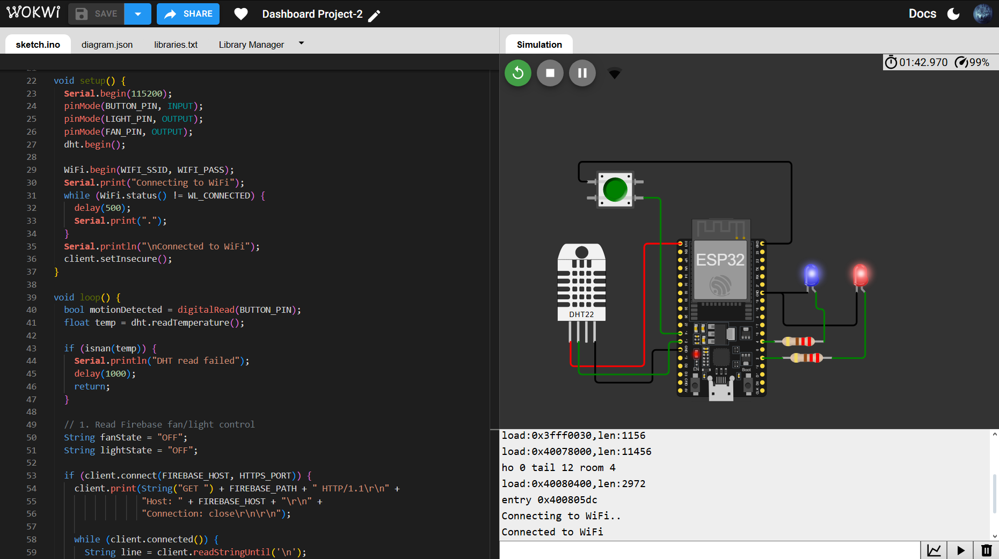
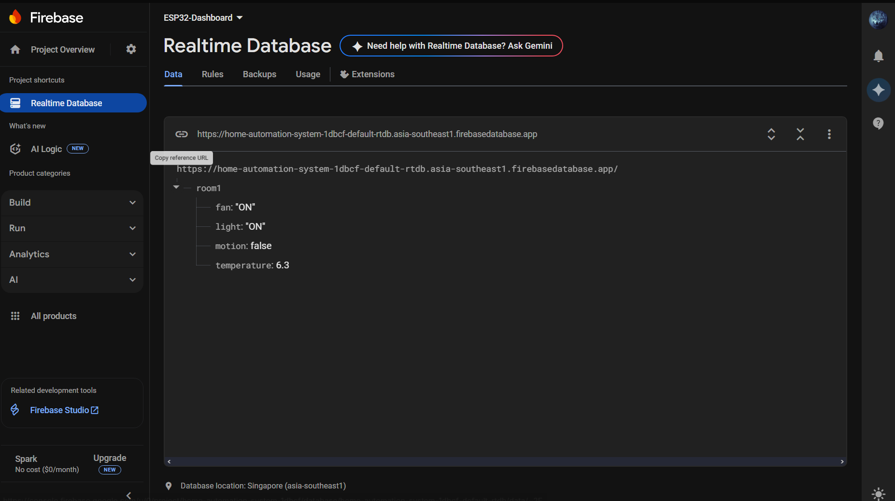
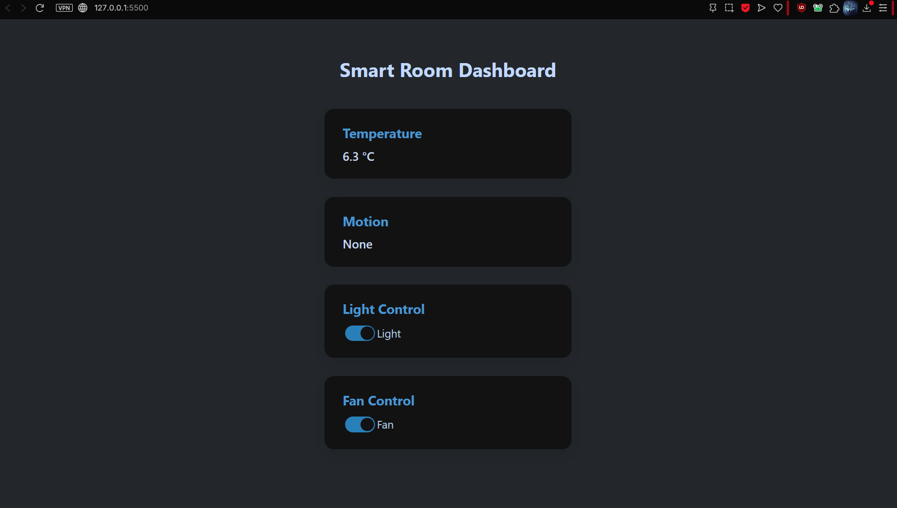

# 🏠 Smart Room IoT Dashboard

A fully functional **smart room dashboard** to monitor and control room conditions (temperature, motion, light, fan) in real time. This project integrates **ESP32**, **Firebase Realtime Database**, and a **Modern HTML/CSS/JS frontend** to simulate a production-level IoT system.

---

## 🌐 Live Demo

🔗 [View Live Dashboard](https://trituslegend.github.io/smart-room-dashboard/)

---

## 📷 Screenshots

| Wokwi ESP32 Simulation | Firebase Realtime Database | Live Dashboard |
|------------------------|----------------------------|----------------|
|  |  |  |


---

## 🔧 Tech Stack

- 🧠 **ESP32 (simulated on Wokwi)**
- ☁️ **Firebase Realtime Database**
- 🌐 **HTML, CSS, JavaScript**
- 📡 **WiFiClientSecure** (ESP32 HTTP requests)
- 🔌 **Wokwi ESP32 simulation**

---

## ⚙️ Features

- ✅ Real-time temperature monitoring via **DHT22**
- ✅ Motion detection using button (simulated PIR)
- ✅ Toggle **Light** and **Fan** from the dashboard
- ✅ Automatic fan ON at temperature > 27°C
- ✅ Automatic light ON via motion; OFF after 5 seconds
- ✅ Firebase-based two-way sync
- ✅ Fully responsive & clean UI

---

## 🔌 Wokwi Simulation

🔗 [Open Wokwi Project](https://wokwi.com/projects/434713305542664193)

📁 Files:
- `sketch.ino` — controls ESP32 logic
- `diagram.json` — wiring layout

---

## 🔥 Firebase Setup

1. Create a Firebase project → enable **Realtime Database**
2. Set rules to:
   ```json
   {
     "rules": {
       ".read": true,
       ".write": true
     }
   }


3. Copy your config and replace it in `app.js`:

   ```js
   const firebaseConfig = {
     apiKey: "...",
     authDomain: "...",
     databaseURL: "...",
     ...
   };
   ```

📁 Sample structure in Realtime Database:

```json
{
  "room1": {
    "temperature": 24.5,
    "motion": true,
    "fan": "OFF",
    "light": "ON"
  }
}
```

---

## 🚀 Getting Started

1. Clone the repo or download ZIP
2. Open `index.html` in your browser
3. Update `app.js` with your Firebase config
4. (Optional) Upload to GitHub and enable GitHub Pages to host

---
